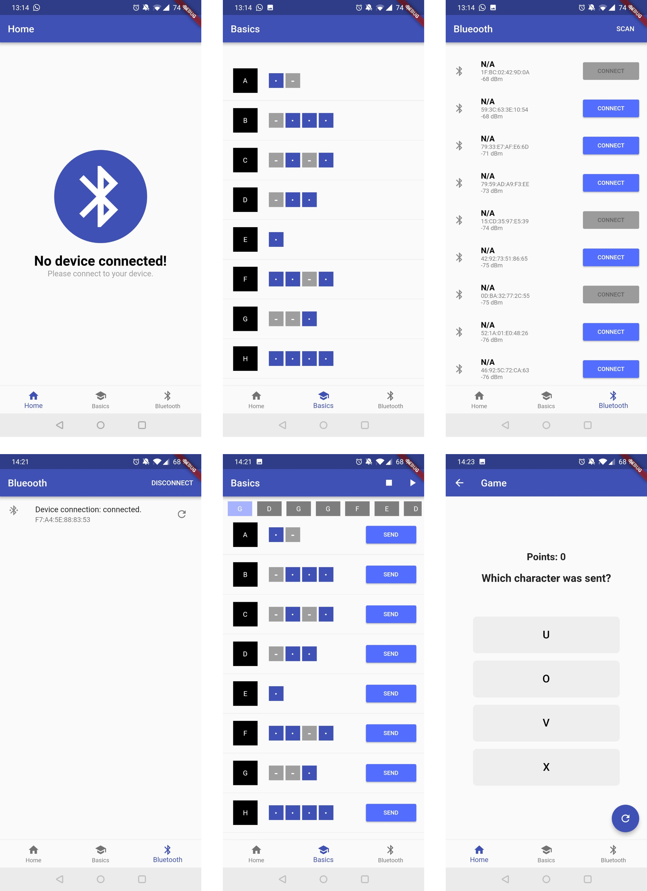

# mobile_computing

Application written for the lecture *Mobile Computing* in WS 18/19.

The goal was to implement an application that connects to a wearable (a glove with five vibration motors) via Bluetooth Low Enegery (BLE).

With the help of the application one can create a queue of letters which are translated into Morse code via the vibration motors.
In addition, the application has a game mode in which a Morse code is presented and the user must guess the correct letter.

